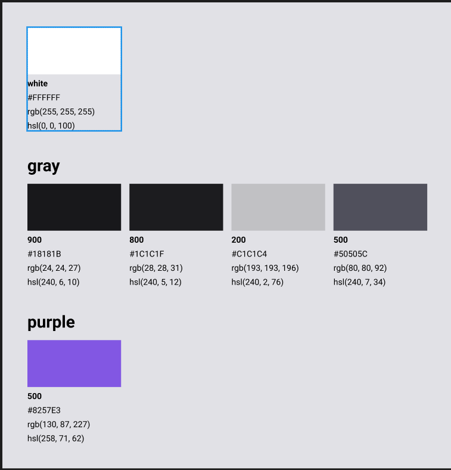
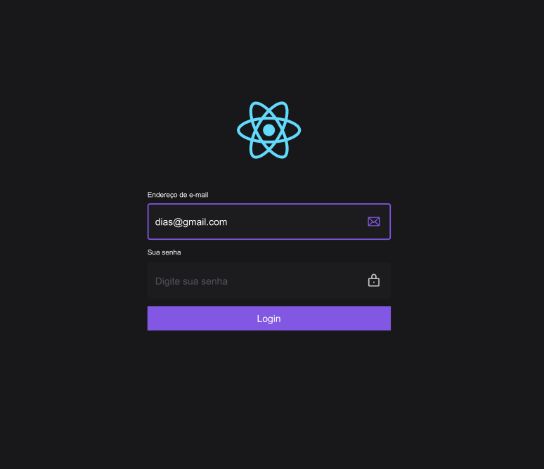

<h1 align="center">
  Automatization of design tokens
</h1>

<br></br>

  

## 🚀 Getting started

Clone the project and access the folder.

```bash
$ git clone https://github.com/diaspd/figma-tokens.git

# Install the dependencies
$ npm install

$ npm run build

```

## 💻 Technologies

This project was developed with the following technologies:

- Figma
- Java Script
- Style Dictionary


## 📄 Project
💰 Project to help developers and designers to import colors from figma to code.

<br></br>

## 🔖 Layout
- [Desing tokens - Figma](https://www.figma.com/file/jMS3IzcoWVcXLFn6i3AD1g/Figma-for-devs?node-id=8%3A15&t=WdgETcQzY1R4jc4T-0)


<br></br>

Made with ♥ by Pedro Dias <br></br>

If you can give a little star, I appreciate it 🤩
